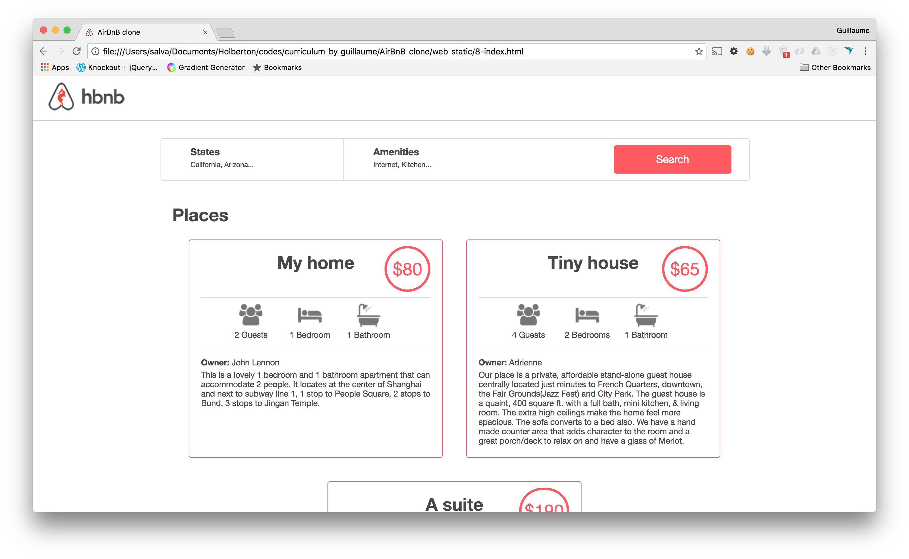
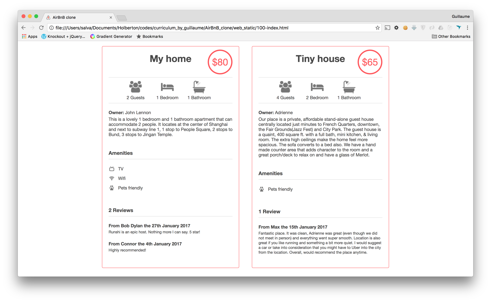
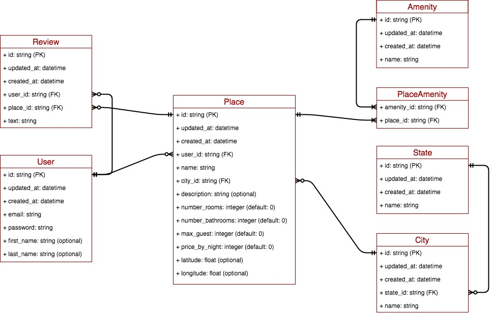

#  AirBnB Clone V.4 - Web dynamic

Project Links: [v0.0](https://github.com/peytonbrsmith/airbnb_clone) [v0.5](https://github.com/peytonbrsmith/airbnb_clone_v2) [v0.75](https://github.com/peytonbrsmith/airbnb_clone_v3) [Final - You Are Here](https://github.com/peytonbrsmith/airbnb_clone_v4)

This was an iterative and collaborative project which spanned multiple repositories and contributors.

The goal of the project was to deploy a recreation of the [AirBnB website](https://www.airbnb.com/ "AirBnB website").

-   A command interpreter to manipulate data without a visual interface,
    like in a Shell (perfect for development and debugging)
-   A website (the front-end) that shows the final product to everybody:
    static and dynamic
-   A database or files that store data (data = objects)
-   An API that provides a communication interface between the front-end
    and your data (retrieve, create, delete, update them)

## Final product

### The console

-   create your data model
-   manage (create, update, destroy, etc) objects via a console /
    command interpreter
-   store and persist objects to a file (JSON file)

### Web static

-   learn HTML/CSS
-   create the HTML of your application
-   create template of each object

### MySQL storage

-   replace the file storage by a Database storage
-   map your models to a table in database by using an O.R.M.

### Web framework - templating

-   create your first web server in Python
-   make your static HTML file dynamic by using objects stored in a file
    or database

### RESTful API

-   expose all your objects stored via a JSON web interface
-   manipulate your objects via a RESTful API

### Web dynamic

-   learn JQuery
-   load objects from the client side by using your own RESTful API

## Data diagram

## Synopsis
This is the 4th and FINAL version of our AirBnB clone project. We will be using python3, RESTful API, MySQL, Flask, and jQuery AJAX

## Table of Contents
* [Environment](#environment)
* [File Descriptions](#file-structure)

## Environment
This project is interpreted/tested on Ubuntu 14.04 LTS using python3 (version 3.4.3), jQuery (version 3.x), MySQL (version 5.7), Flask, and Chrome (version 57.0)

## File Structure
- **[api](api)** directory contains Flask web applications for a RESTful API
- **[models](models)** directory contains all classes used for this project:
- **[tests](tests)** directory contains all unit test cases for this project.
- **[web_dynamic](web_dynamic)** directory contains all files necessary to start a dynamic Flask web application.
- **[web_flask](web_flask)** directory contains all files necessary to start a Flask web application.
- **[web_static](web_static)** directory contains all html, css and images used for the static website.
- [0-setup_web_static.sh](0-setup_web_static.sh) - bash script that sets up web servers for the deployment of `web_static`
- [1-pack_web_static.py](1-pack_web_static.py) - Fabric script that generates a .tgz archive from the contents of `web_static`, using the function `do_pack`
- [2-do_deploy_web_static.py](2-do_deploy_web_static.py) - Fabric script (based on [1-pack_web_static.py](1-pack_web_static.py)) that distributes an archive to web servers, using the function `do_deploy`
- [3-deploy_web_static.py](3-deploy_web_static.py) - Fabric script (based on [2-do_deploy_web_static.py](2-do_deploy_web_static.py)) that creates and distributes an archive to web servers, using the function `deploy`
- [AUTHORS](AUTHORS) - list of Authors who have worked on this project.
- [console.py](console.py) - the console is a command line used to interact with the storage engines. 
- [setup_mysql_dev.sql](setup_mysql_dev.sql) - MySQL script to set-up the hbnb_dev_db database.
- [setup_mysql_test.sql](setup_mysql_test.sql) - MySQL script to set-up the hbnb_test_db database.

